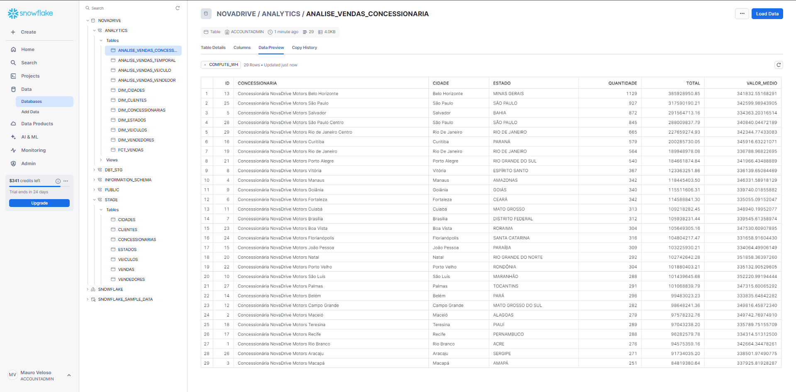

# Projeto de Engenharia de Dados

## Descrição do Projeto
Este projeto foi desenvolvido durante o Bootcamp de Engenharia de Dados, orientado pelo tutor Fernando Amaral. O objetivo foi criar um pipeline completo de dados, desde a extração e carga dos dados até a transformação e análise, utilizando ferramentas modernas de engenharia de dados.

## Objetivo
Explorar dados da empresa NovaDrive Motors e montar uma arquitetura de engenharia de dados para prover informações para a área de vendas. O projeto visa responder perguntas de negócio relacionadas a:
- Vendas por concessionárias
- Vendas por veículo
- Vendas por vendedor
- Análise de vendas ao longo do tempo

## Tecnologias Utilizadas

<table align="center">
  <th></th>
  <tr>
    <td align="center">
      <a href="https://www.python.org">
      <a href="https://aws.amazon.com/pt/">
      <a href="https://www.docker.com/">  
      <a href="https://airflow.apache.org">
      <a href="https://www.snowflake.com/pt_br/">
      <a href="https://www.getdbt.com">
      <a href="https://lookerstudio.google.com/overview">
    </td>
  </tr>
</table>

- **Python**: Utilizado para a ingestão dentro da DAG do Airflow.
- **AWS (EC2 e Ubuntu)**: Infraestrutura na nuvem.
- **Docker**: Utilizado para conteinerizar o Airflow na instância EC2.
- **Airflow**: Orquestração de workflows.
- **Snowflake**: Modern DataWarehouse para armazenamento e processamento de dados.
- **dbt (Data Build Tool)**: Ferramenta de transformação de dados.
- **Looker**: Ferramenta de visualização de dados.

## Estruturação do Projeto
1. **Introdução**

    
    
    A arquitetura do projeto foi desenvolvida para atender às necessidades de ingestão, transformação e visualização de dados da empresa NovaDrive Motors, utilizando tecnologias de ponta no ecossistema de dados

2. **Exploração de Dados da NovaDrive Motors**

    
    
    A exploração dos dados inclui a análise das informações disponíveis no banco de dados ERP da empresa. Esta análise é crucial para entender as fontes de dados, identificar padrões e preparar os dados para as próximas etapas do pipeline de transformação. A imagem acima ilustra a estrutura e o esquema do banco de dados ERP, fornecendo uma visão geral das tabelas e suas interconexões.

3. **Configuração do Airflow, criação de DAG e carga de dados**

    
    
    A configuração do Airflow na AWS foi realizada utilizando uma instância EC2 com o sistema operacional Ubuntu. O Airflow foi conteinerizado com Docker para gerenciar o pipeline de dados. A imagem acima mostra uma visualização das DAGs (Directed Acyclic Graphs) configuradas no Airflow, que orquestram a ingestão de dados. Essa configuração permite um gerenciamento eficiente e escalável dos processos ETL.
    O arquivo ingestion.py localizado na pasta dags/ é o responsável pela definição da DAG que orquestra a ingestão de dados. Esse script em Python define as tarefas e suas dependências, organizando o fluxo de trabalho para que a ingestão de dados ocorra de forma coordenada e automática.

    - **Estrutura do Projeto Airflow**:
      ```plaintext
      airflow/
      ├── config/
      ├── dags/
            |── ingestion.py
      ├── logs/
      └── plugins/
      ```
 

4. **Estruturação no Snowflake**

         
 

5. **Transformação dos dados com dbt e construção da camada analítica**

   O dbt é usado para transformar os dados e construir uma camada analítica robusta. A estrutura do projeto dbt foi organizada de forma a separar claramente as diferentes camadas de dados, facilitando a manutenção e o entendimento do fluxo de transformação.

   - **Estrutura do Projeto dbt**:
     ```plaintext
     novadrive/
     ├── analysis/
     ├── dimensions/
     ├── facts/
     └── stage/
     ```

   ### Lineage Graph

   O **Lineage Graph** no dbt é uma visualização que mostra como os modelos de dados estão interconectados. Ele ajuda a entender a dependência entre os diferentes modelos e facilita a rastreabilidade das transformações. Isso é fundamental para manter a integridade do pipeline de dados e identificar rapidamente quais modelos serão afetados por mudanças.

   

   ### dbt Docs

   O **dbt Docs** é uma ferramenta de documentação interativa gerada a partir do próprio projeto dbt. Ele oferece uma visão clara da estrutura do projeto, das tabelas, dos modelos e das suas dependências. Além disso, fornece uma documentação centralizada que ajuda as equipes a entender o fluxo de transformação dos dados, a lógica de negócios e a estrutura de cada modelo dentro do pipeline de dados.

   


6. **Criação de Dashboards e avaliação de alternativas ao projeto**

       

## Resultados
- Automatização do processo de ingestão de dados para a área de Stage.
- Construção de uma camada analítica utilizando dbt.
- Geração de dashboards que proporcionam insights sobre vendas por concessionárias, veículos, vendedores e análise de vendas ao longo do tempo.
